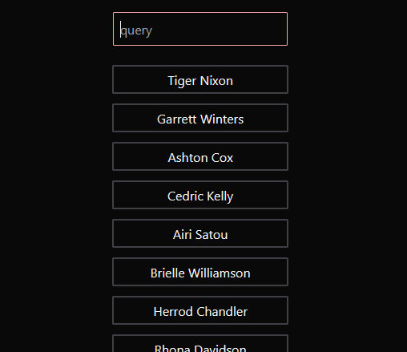

# Study project

## Search filter in React

Search filter component using Typescript and and demonstration using [Dummy api example](http://www.dummy.restapiexample.com/).

## Things I've learned

* Tailwind css basics;
* Basic concepts of React with TypeScript;
* Async/await to make API calls;

### Study resources

* Async/await in TypeScript: [access](https://blog.logrocket.com/async-await-in-typescript/)
* Fetch with async & await and TypeScript: [access](https://www.carlrippon.com/fetch-with-async-await-and-typescript/)
